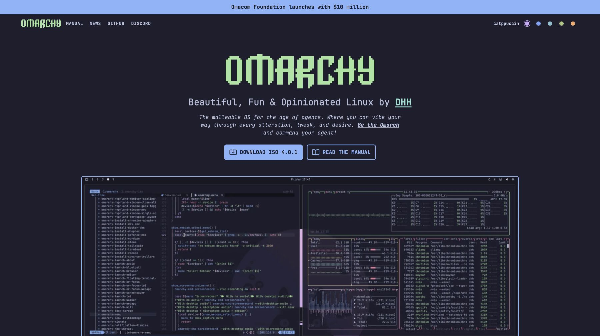

# Omarchy homepage redesign

A homepage redesign for [omarchy.org](https://omarchy.org), created in response to [DHH’s design-team call](https://x.com/dhh/status/2093946369731854766).

**[View the live redesign](https://slickslayer6.github.io/omarchy-page/)**

## Design direction

The existing homepage gives every destination similar visual weight. This proposal keeps Omarchy’s typography, palettes, imagery, and personality, but gives the page a clearer product story:

1. See what Omarchy is and get it.
2. Experience the desktop through its stock themes.
3. Understand what makes it beautiful, fun, and opinionated.
4. Explore the wider project through a compact directory.

The theme dots are part of the pitch, not just decoration: they recolor the page and swap the hero desktop so the website behaves a little more like Omarchy itself.

## Implementation

Static HTML, CSS, and a small amount of JavaScript, following the shape of [`omacom/omarchy-site`](https://github.com/omacom/omarchy-site). No framework or build step is required.

- `index.html` — the homepage
- `chrome.html` — how inner pages would wear the compact bar

Catppuccin is the default theme. The other options use stock Omarchy palettes, and the preference persists locally. YouTube videos remain poster images until someone chooses to play one.

## Scope notes

- The two-video selection reflects the live homepage when this redesign was started. More videos were added to the production homepage afterward; the smaller set here is intentional rather than an implementation omission.
- Release numbers, announcement copy, and other changing content are representative. In production they should continue to come from the existing site’s shared data or templates.
- Brand artwork, desktop captures, theme previews, and community workstation photography are presented here solely as part of this Omarchy redesign concept and originate from the Omarchy project and community.
